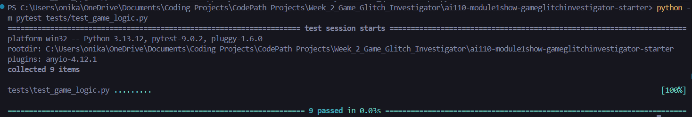
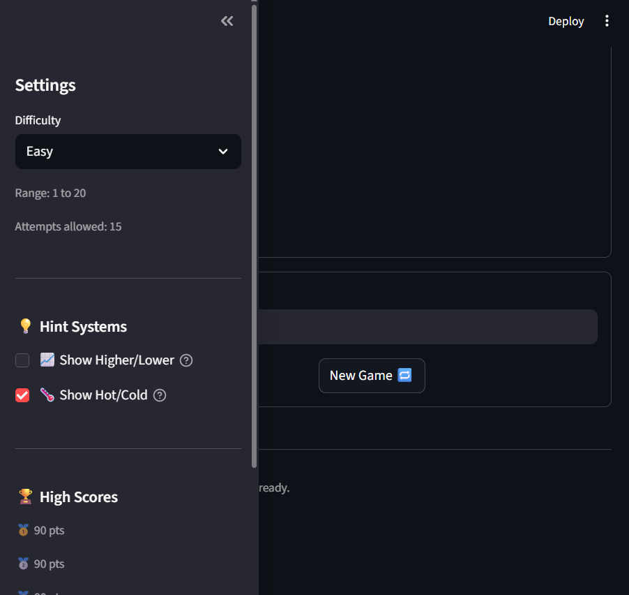
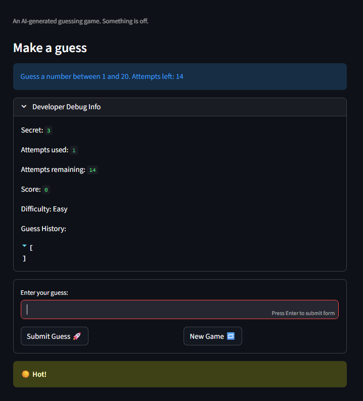
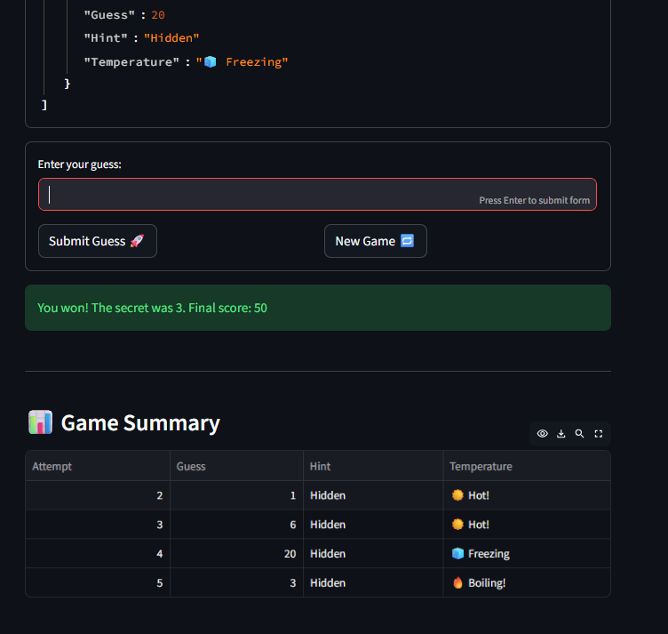

# 🎮 Game Glitch Investigator: The Impossible Guesser

## 🚨 The Situation

An AI pair programmer generated a simple "Number Guessing Game" using Streamlit. Unfortunately, it handed over a codebase full of glitches: the game was unplayable, the hints actively lied to the player, and the difficulty scaling was completely backwards.

My mission was to step in as the Game Glitch Investigator to diagnose, explain, and responsibly repair the AI-generated code.

## 🛠️ Setup & Execution

To run this game locally:

1. Install the required dependencies: `pip install -r requirements.txt`
2. Launch the Streamlit app: `python -m streamlit run app.py`
3. Run the automated test suite: `pytest` or `python -m pytest tests/test_game_logic.py`

---

## 📝 Documenting the Experience

### The Game's Purpose

This project is an interactive, Streamlit-based web application where a player attempts to guess a randomly generated secret number within a limited number of tries. Players can choose from different difficulty levels (Easy, Normal, Hard, and "I'm Feeling Lucky") and use visual hint systems to help them narrow down the correct answer.

### Bugs Discovered

During the initial "Glitch Hunt", I found several critical logic and state flaws:

- **The Lying Hints:** The directional hints were inverted (e.g., telling players to "📈 Go HIGHER!" when their guess was already too high).
- **Broken Difficulty:** The "Hard" difficulty actually gave a smaller range of numbers (1–50) than the "Normal" mode (1–100), making it the easiest mode.
- **Silent Crashes:** Entering decimal numbers or empty strings caused silent truncation or unhandled exceptions.
- **Double Penalties:** The scoring system unfairly double-penalized players by deducting points for wrong guesses while also reducing the potential win payout.
- **State Glitches:** A bizarre type-juggling bug caused the secret number to turn into a string on every even attempt, breaking the comparison logic.

### Fixes Applied

To repair the application, I refactored the core game logic out of the UI layer (`app.py`) and into a dedicated `logic_utils.py` file. I corrected the inverted hint directions, fixed the scoring formula so points only scale positively upon a win, implemented robust input validation, and stabilized the Streamlit `st.session_state` so the secret number and attempt counters persist correctly across reruns without consuming attempts on invalid inputs.

---

## 🚀 Completed Challenges

I went beyond the base requirements to deepen my technical reasoning and build out real-world engineering features:

### 🧪 Challenge 1: Advanced Edge-Case Testing

Using AI generation, I created a robust `pytest` suite in `test_game_logic.py` that targets specific edge-case inputs. The game is now verified to handle negative numbers, decimals, and extremely large numbers gracefully without crashing.

### 🏆 Challenge 2: Feature Expansion via Agent Mode

I collaborated with the AI Agent to plan and implement a persistent **High Score leaderboard**.

- Scores are saved automatically to a `high_scores.json` file.
- The sidebar displays a live Top 5 leaderboard for the currently selected difficulty.
- The agent designed the architecture to keep the file parsing inside `logic_utils.py` to maintain independent testability.

### 📚 Challenge 3: Professional Documentation and Linting

I used Claude Code to add professional-grade, Google-style docstrings to every function in `logic_utils.py`. I also reviewed the code for PEP 8 style compliance, resolving formatting issues, standardizing dictionaries, and ensuring strong type hints.

### 🌡️ Challenge 4: Enhanced Game UI

I added a structured and user-friendly output to the game to elevate the player experience:

- **Dynamic Hot/Cold Emojis:** Players can toggle a temperature-based hint system that uses color-coded Streamlit alerts (e.g., 🔥 Boiling, ❄️ Cold) based on proximity to the secret.
- **Game Session Summary Table:** At the end of a session, a sleek `st.dataframe` renders a timeline of all guesses, temperatures, and hints for that round.

---

## 📸 Demo

**1. Passing Automated Tests**

> 

**2. The New Player Experience**

> 

> 

> 
